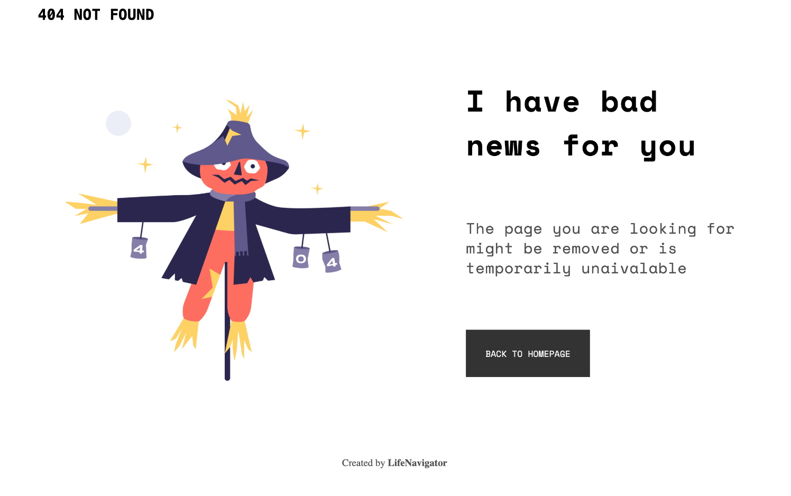

<!-- Please update value in the {}  -->

<h1 align="center">{Error 404 Page}</h1>

   Solution for a challenge from  <a href="http://devchallenges.io" target="_blank">Devchallenges.io</a>.

  <h3>
    <a href="https://lifenavigator-404-3cb47c.netlify.app">
      Demo
    </a>
     | 
    <a href="https://github.com/LifeNavigator/Error-404-page">
      Solution
    </a>
     | 
    <a href="https://devchallenges.io/challenges/wBunSb7FPrIepJZAg0sY">
      Challenge
    </a>
  </h3>

<!-- TABLE OF CONTENTS -->

## Overview

Basic webpage for when an error 404 is given.

